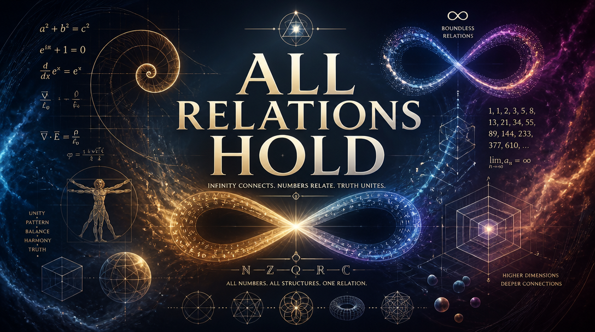
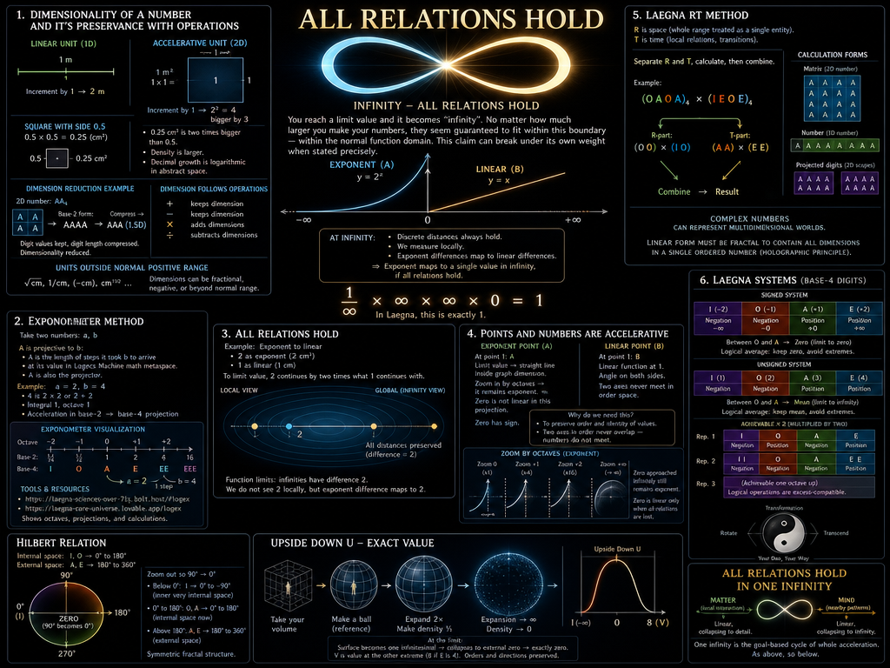
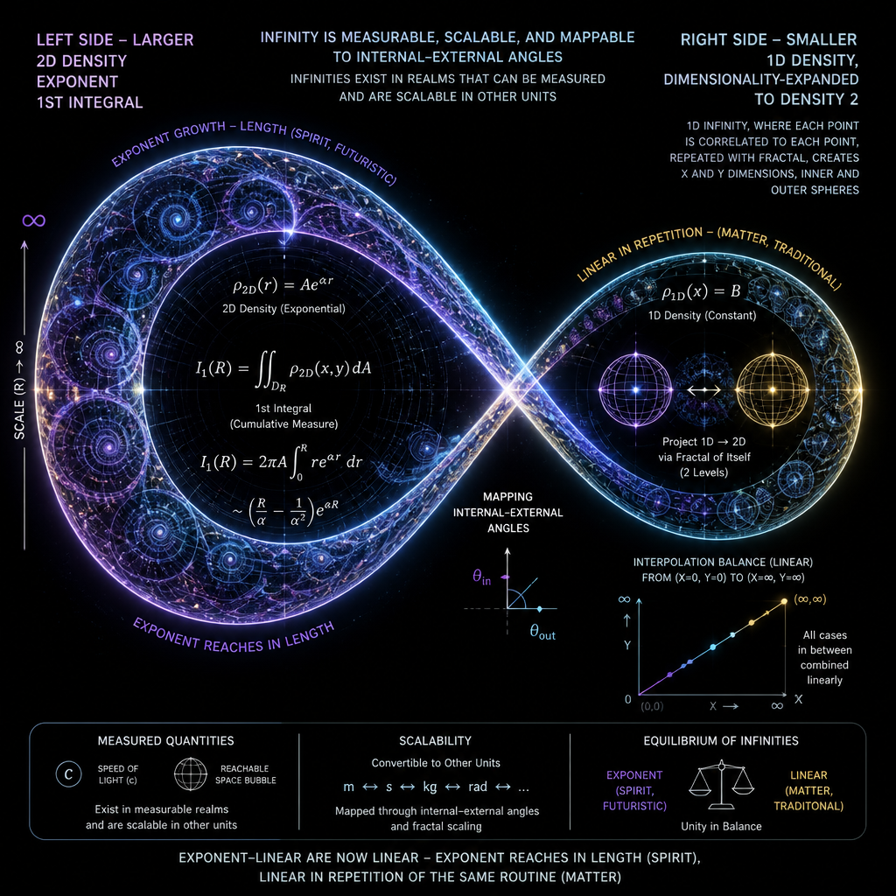
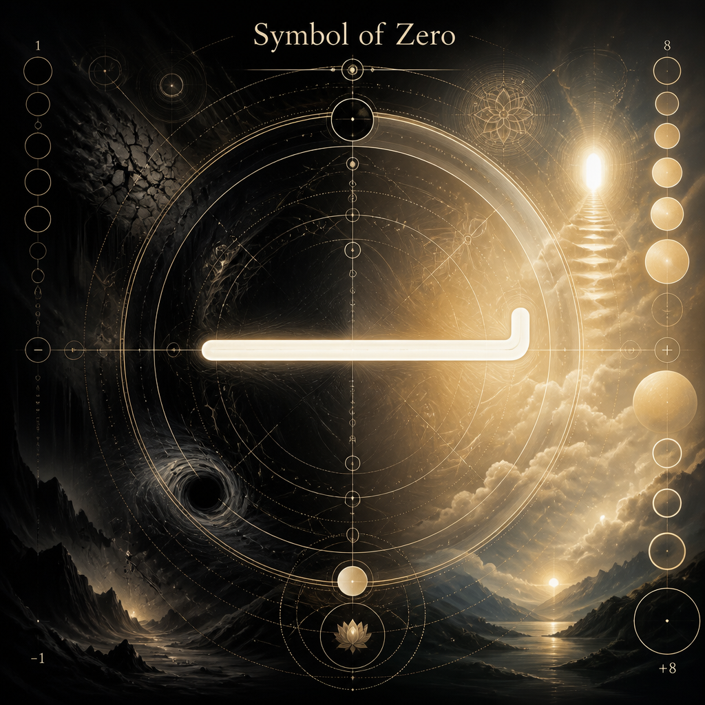

# Infinity - all relations hold

Say you get limit value and it becomes "infinity". Instant, brutal stop, and however much *larger* you make your numbers, they seem to be guaranteed to fit in this boundary, within the normal function domain - claim which can break under it's own weight, when you state it properly.

## Dimensionality of a number, and it's preservance with operations

Take linear and accelerative Unit, and by "Unit" we mean "1" and by "Identity" we mean the diagonal:
- 1 m - 1 m in normal space. Increment by 1, and it's 2.
- 1 m^2. 1 m in 2D space, weight of an 1 * 1 = 1 square. Increment it by 1, and it becomes 2 * 2 = 4, bigger by 3.

Take square with side length 0.5:
- It's volume is 0.5*0.5=0.25.
  - Square is half, in size, compared to it's side length.

0.5 cm * 0.5 cm = 0.25 cm^2 gives us the space, whose density is now larger:
- 0.25 cm^2 is two times bigger than 0.5.
- Therefore, this new space is not only more precise, but includes account to "1", which is two times bigger than 0.5.
- We can see the growth factor of decimal number, after zero or minus zero and comma is logarithmic in abstract, unitless space.

0.25 cm^2 is accelerative - 1 incremented by 1 is 4. Therefore, Laegna geometric projection which allows linear and exponent channel, is normally normalized to scale in one octave, in laegna base-4 numeric view, but speaking in Latin Decimal paradigm, or the underlying reality Laegna number is going to mock: without our careful selection for interpolation, scaling changes order of points of these digits.
- One can now prove Laegna space is not Eucleidean space.
- Normally, one can conclude 2-channel Eucleidean space, with lin and exp, alternatively log and lin channels.
  - Difference of these channels, which map R (I=>E logexp) and T (O=>A linlin) \[Laegna digits: I, O, A, E; $b_4$\] either to ZX, or XY in laegna Z (log), X (lin), Y (exp) three base octaves, where octave is zoom out or zoom in by infinity, where sphere at limit value where it's surface is flat, altough it's perfect sphere because topology is consistent, *can not* project this topology to Eucleidean space: three spaces, Z, X, Y channels which pairwise map to R, T => lower ZX, higher XY, and diagonal ZY => to simplify your calculations to two channels and linearized views and consequences of first-order Laegna Logecs, mostly operating in single-digit space or you can count the digits on fingers of two, often one hand - such as 4-digit as absolute universe.

Using unit cm is 1D, linear dimension; unit 2D is exponent-linearized, and units sqrt(cm), 1 / cm, (-cm) etc. can create dimensionalities outside the normal, positive range.

1.5 dimensions. Simple:
- Take number of 2 dimensions.
- Reduce dimensionality by 0.5: compress exponent (infinity angle moves lower), expand linear (zero moves higher).
  - One point has 2 * 1.5 NN, nearest neighbourhood:
    - Typically we project this in squares.

Let's say AA $b_4$ is two-dimensional number:
- AA $b_4$ = AAAA $b_2$
- Take the base-2 result, keep digit values, compress R (digit length).
  - AAA is result: $base_2$ AAA is $base_4$ 2D represented AA, with dimensionality reduced to less dimensional density.
    - This is not normalized base_4 number, so perhaps $base_4$ EEE would be $A=>E$ and $O=>I$ conversion, boundary-to-boundary, able to keep this shape well enough for base_4 calculations, unless you want EEEEEE with also digit length multiplied by 2, which includes negative I and O digits share positions with positive A and E, so the range of 4 digits is 2 in this case and two times longer, is 4 times deeper - this excess of negative values can be distributed evenly.

Dimension follows operations, for example multiplication adds to it's power.

We use also:

## Exponometer method

We take two numbers:
- `a, b`

A is projective to b:
- A is the length of steps it took b to arrive at it's value in math metaspace of Logecs Machine.
- A is also the projector:
  - A is 2, b is 4 - 4 is 2*2 or 2+2, therefore it's integral 1, octave 1, acceleration in base-2 => base-4 projections.
  - https://laegna-sciences-over-7lsj.bolt.host/#logex - exponometer is calculated, octaves shown in visualization.
    - https://laegna-core-universe.lovable.app/logex - same resource, linking directly to original materials (text repo, source math calculations -> later you find demonstrations)

## Laegna RT method

R is space: it's operation done on whole number range is if it was a single number, and thus it's symmetric positioning is as a digit.
- R and T are calculated separately in calculation: OAOA * IEOE, if these numbers are RTRT numbers, digits R = OO * IO, T = AA * EE, the result is then combined again. Alternatively, single multiplication can be thought in head - result is identical, but numbers might have inference in simpler head-calculations or floating-point calculus if precision is lost, and dimensions melt: the multiplication might affect digits in way that original dimensions are not separate, but united; otherwise it's the same.

Calculation:

- Matrix (2D number, dimensionality is symmetric separate dimensions):

  ```
  AAAA
  AAAA
  AAAA
  AAAA
  ```

  Complex number, for example, can present multidimensional world.

- Number (1D number):

  ```
  AAAAAAAAAAAAAAAA
  ```

  Discrete or continuous number goes linearly. Additional dimensions are *outwards*, even if it's simplified projection of outwards itself - because reality, the linear, *is* simplified projection of outwards, which must be more similar to Hilbert's "infinite dimensionality", either in it's fundamentals, or evolved behaviour.

- Projected digits: (2D number, dimensionality is scopes and spheres)

  ```
  AAAA AAAA AAAA AAAA
  ```

  Complex number, for example, in it's linear form must be somehow fractal, where dimensions are contained in each others, to be possible to order it. Yet it's written in two real-number components: but the calculation form, add number to square root of number, is supposed to result in single number, and this must take a form of a hologram because otherwise: the digits are impossible to contain, impossible to give unique identities.

# All Relations Hold



For example, exponent to linear:
- 2 as exponent (i.e. 2 cm^2)
- 1 as linear.
- To limit value, 2 is continued by two times or what 1 is continued with, and discrete distances always hold.
  - Function limits: infinities have difference 2.
  - We measure it locally: we do not see difference 2, but exponent difference which maps to difference 2.
    - Thus, exponent maps to single value in infinity, if all relations hold.

# Points and numbers are accelerative

Imagine exponent function at point 1: this is A.

Imagine linear function at point 1: this is B.

Both, as numbers, are not structurally different.

They have mathematically well-described relations.

Yet, A != B, because:
- Numberness is order on axe, and it's position in order.
- Counting back and forth, *two axes never meet*, because in order, numbers do not overlap.

Why we need this?

Imagine point B. This is angle, and it's angle on both sides.

Imagine point A. It's limit value is straight line:
- This straight line is real, but it's inside graph dimension, not inside smooth math, and we *lost all properties with this attempt*
  - Not geometric, numbers distort and all values beyond single point are somehow "equal".
 
Zoom closer to curve function of A:
- Zoom closer and closer, by octaves: it *remains exponent*.
  - After zero, zoom in infinitely, and zero is infinity, thus zero has sign.
  - It *remains exponent*
  - In this projection, zero is not linear.
- Zero are linear only if relation to others scales and scopes are lost, and we use this precisely in graph projection, and rebuild relation tree to preserve exact value - but what this has to do with smooth, realtime math like physics or system control and automation? You cannot code this perfectly, because *it's not visible in decimal space, **when exactly** the number **turned**. We assume if it turns, it does not turn between the points, but at the points - from ideal states and linear relations, we enter time and space with it's *whole paradox* - including octaves, waves, inference patterns, heat => vibration relations, Einsteins Theory of Relativity etc. - it all just *happens* to *numbers themselves solely we want to have any numbers at all*. By laegna math, physics has managed to have numbers, goals, satisfied goal-states, very well for many systems, for example magnet is relaxed if connected, water does not dense more once it has united with a drop. Physics has tension, optimization, relaxation, intertension - in Laegna math, this leads to hidden goal, because we measure acceleration and speed and do not get them exactly equal; we get the machine optimizing, target energy.

### Finally

1 / infinity * infinity * infinity * 0 - in Laegna, this is exactly 1.

Why?

I decided to *preserve the identity of the values*.

I solved *various projections with projections*:
- Value range does not project exponent towards range, zero towards zero, because range is different;
  - Normalize range means: number exists in space where it's possible.
- For example, take natural numbers
  - Remove one natural number near infinity, but consider others to be equal
  - Take 1
  - Add 1
  - The amount it became close to infinity is kind of infinitesimal-wrong, if possible at all:
    - As exactly one number was removed, the negative consequence is -1, and it *cancels your whole initial plan exactly and precisely*.
      - This is the danger we see in our evolution, our free-willed optimization and internal decisions to pass the gates not being touched by exter conditions, negative choise of branches.

"Positive choice" of your branch, in evolution - you go as you are, and no "evolution" is doing that to you.

"Negative choice" of your branch, in evolution - you go as you are, but for some reason there are less children, more problems, and your patterns of love do not stamp your evolving identity into patterns of chemical alchemy and the mind which future appears. This is negative reincarnation factor: "self", perhaps, is the identity we pass to our children, our trees and branches and roots - somewhere there is *what is left of your identity*, there is a grandfather recognizing a little bit of you in grandchild; there is a feeling how you *are* your ancestor, who won this, as you walk into your success or failure, not asking and not answering for reality. These are life items, normal conditions - evolution is mathematical and imaginary, "color of your aura", in terms that you have to choose your reality model real.

The probability that human evolution *will* happen, on similar scope, is estimated near-zero, and the "probability" was zero, effectively, in beginning to guarantee there is no life in space we cannot see, especially in terms for some mental waves, soul vibrations, identity codes or essential understanding of "I like us".
- Surely the puzzle is more simple: there is life out there, then we are them. We are definite life out here.
  - So we can build all this model we see - looking at *vitamins in sky*, think of *what feeds* - then ask, *what could eat?* This is the law of evolution and thermodynamics: many lives go eating what they can, and they can eat what is there; evolved to eat there, to feed.

The probability that evolution *did* happen is our reality:
- Talking and estimating *the real evolution in past*, the goal-based dynamics of explaining these models is different:
  - Dice off, but the estimated past *will* continue to life;
  - And it *will* make it to consciousness.
  - And it *did* happen, one hundred percent.

These are additional relations and they hold in one infinity:
- One infinity is goal-based cycle of whole acceleration:
  - Matter - rather local interaction is linear, collapsing to detail.
  - Mind - rather nearby patterns are linear, collapsing to infinity.
 
## Upside down U, exact value

This is where infinity collapses.

Look around to make symmetry snapshot:
- Coming closer, the space starts to surround you, disappearing at center point zero in your center, or mind-s perception center.
  - This is subjective, point of reference: you align your reference to be what they be, each cell runs one local, one global process in our simplification - 1 to 1.
    - This is reference system: ego in center, self beyond, mind above, spirit uniting us.
- A your edges, take this volume and make a ball - this references your volume, and average of unit size.
  - I can expect 1m, 1m^2, 1m^3 etc. to be a standard unity for human if we have such round unit, because it's closest to human size - two times smaller or bigger in various dimensions and positions, up to 4 or 8, means 2-3 digit precision, it does not collapse coordinate systems effectively. Humans seem to *completely agree* about their smooth surface and continuous space, not claim that zero is a big higher or lower and they cannot understand each other - this can be seen as perfect math of linearity condition, not much affected by +/- unless it's many cycles, and the value *becomes* them, normally - and in our averages to build efficient models to represent real combinatoric balance.
  - As you make circle two times larger from unit value, make it two times less dense to condence the matter to infinity; you can prove this runs to zero at infinity, touching the first limit value and not needing the rest.
  - External ball layer is finally one infinitesimal in it's whole surface - this collapses to external zero.
  - Finally it's precisely zero - this is 8 if E is 4, because E is where ball is flat; this is where flatness collapses outwards.
  - This is value of V: notice, we take higher frequecy, the higher channel octave, and at 8, the orders and directions of points must not change directions - as below, so above. Thus, V is very complicated - we can always see that something in number V, and the way it connects extremes at such frequency where 0 is below-0, below-this-linearity-channel, just *resembles* being outwards end and connecting it back to beginning, and this is constituent for many real behaviours - how it's surface is zero where *our eyes see it smooth outside altough the objects are bigger and bigger, but scoping up, finally - the biggest size collapses to zero, and for object to be visible, it must be bigger than infinity and it happens in higher range*.
 
# Hilbert relation

Let's repeat Laegna-Hilbert relation:
- Internal space: I, O => 0..180 degrees.
- External space: A, E => 180..360 degrees.

In Laegna signed system:
- We zoom out in way that 90 degrees become zero degrees.
- Below the zero degrees, I => 0..90, inner very internal space, *exactly symmetric to secong half of external space but polarized in both axes and scales neglated.
- From zero to 180 degrees, O, A => 90..170 degrees, which is *where the internal space is now*
- Above 170 degrees: half of the external space, where higher half is direction-symmetrically projected below zero, but now this fractal is passed from other end, symmetrically.

Basically unsigned system appears, if signed is moved linearly.

## Laegna systems

Base-4 digits: I, O, A, E

Signed:
- I: -2 (Negotion) - bottomup; -infinity - topdown.
- O: -1 (Negation) - discrete; -0 - continuous.
- A: 1 (Position) - discrete; +0 - continuous.
- E: 2 (Posetion) - bottomup; +infinity - topdown.

Between O and A, there is zero - the limit value to zero.
- Logical average is to keep the zero, and avoid extremes; if *achievable* is multiplied by two, extremes are not avoided.

Unsigned:
- I: 1 (Negotion)
- O: 2 (Negation)
- A: 3 (Position)
- E: 4 (Posetion)

Between O and A, there is mean - the limit value to infinity keeps mean.
- Logical average is to keep the mean, and avoid extremes; if *achievable* is multiplied by two, extremes are not avoided.

Achievable multipled by two:

Representation 1:
- I: Negotion
- O: Posetion
- A: Negation
- E: Position

Representation 2:
- I: Negation Negation
- O: Negation
- A: Position
- E: Position Position

Representation 3:
- Achievable is one octave up, logical operations are excess-compatible.

This is like rotating, transforming and transcending the symbol of Dao - altough with Laegna Dao Symbol, you can do it in your own way.

# Art - Symbol Of Zero



<br>


