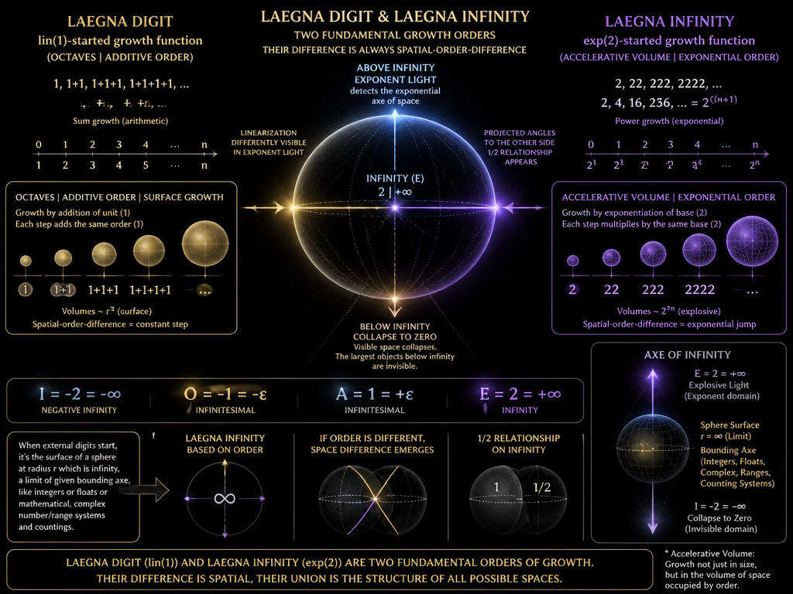
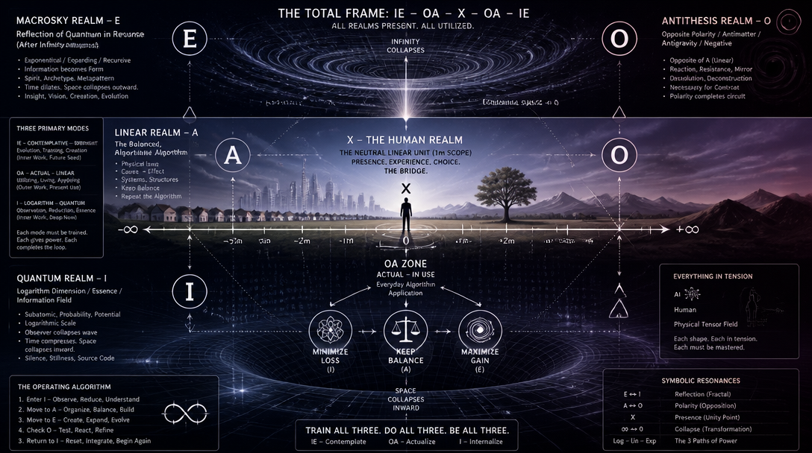
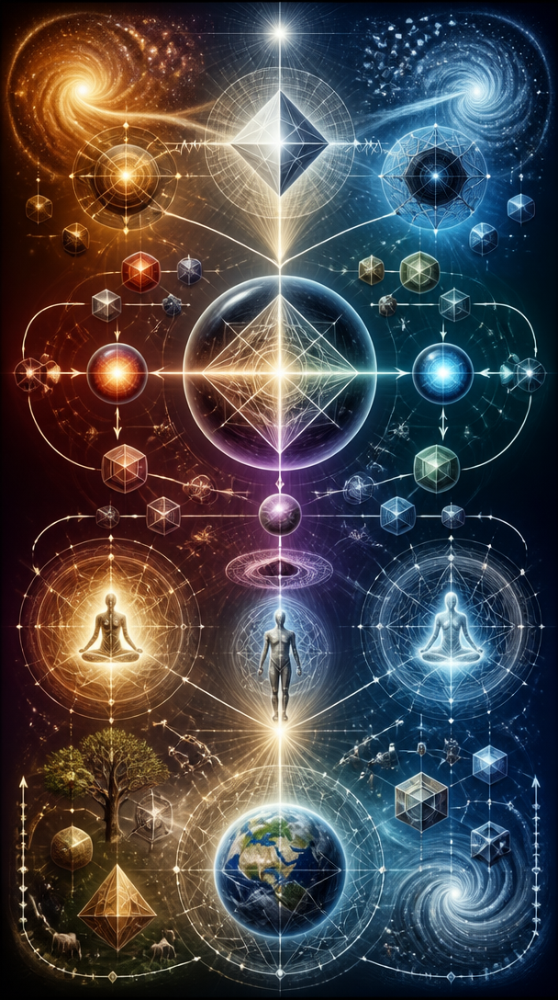
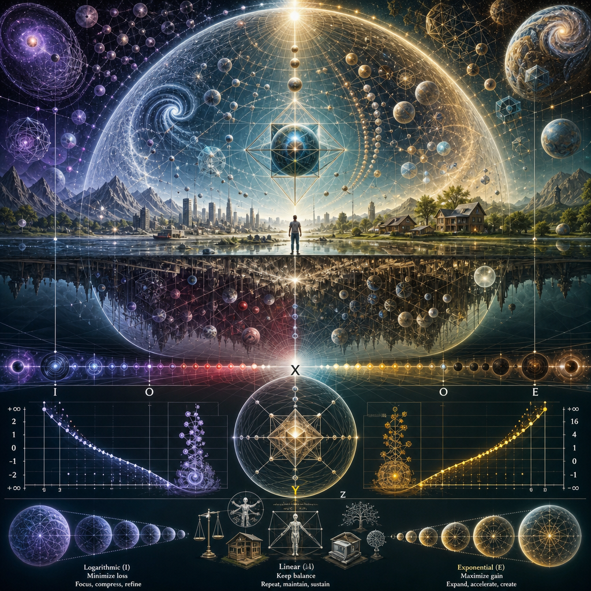

Digit maps to infinity.

# Mathematically

# Naturally

# Physically

# Evolutionarly

Log has two plus infinities, because in infinity, logarithm becomes a deductive - evolution compressed to singleton as infinity grows.

