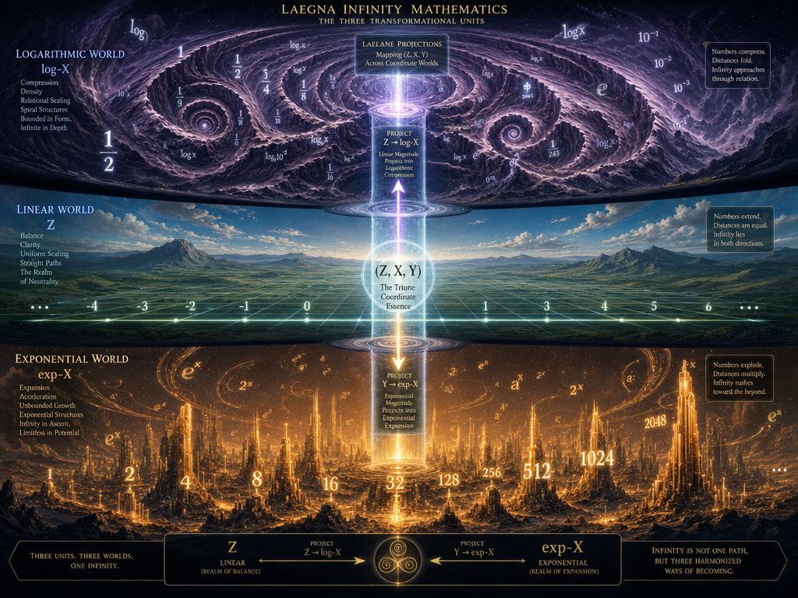
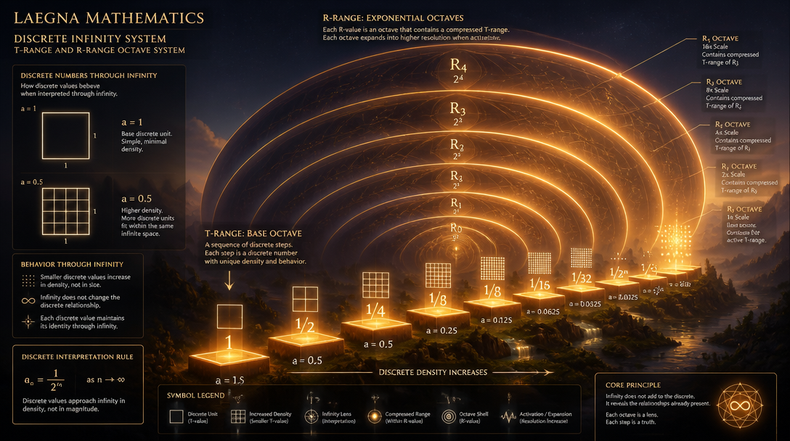
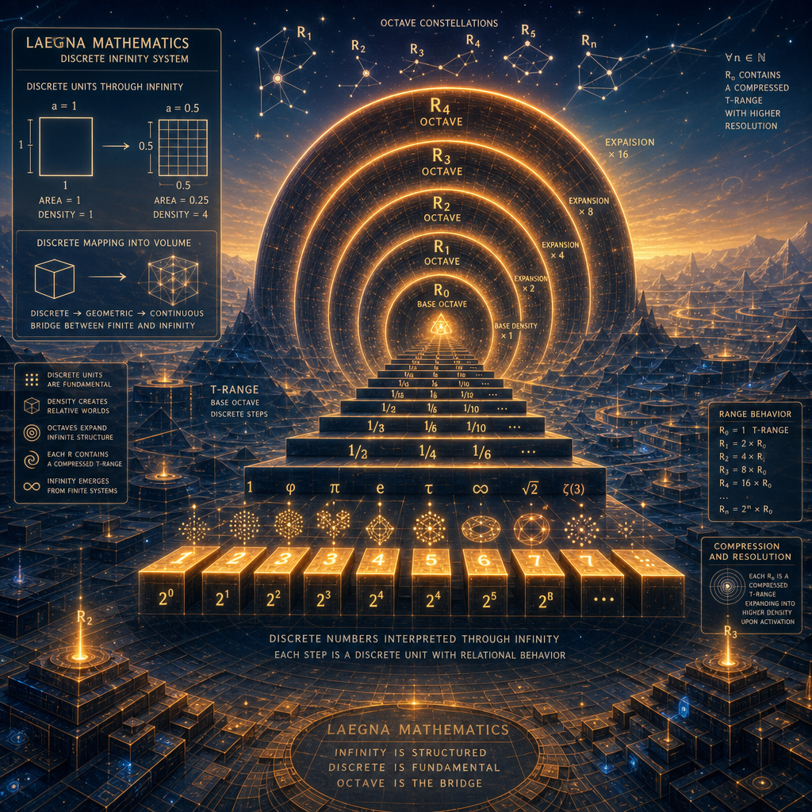
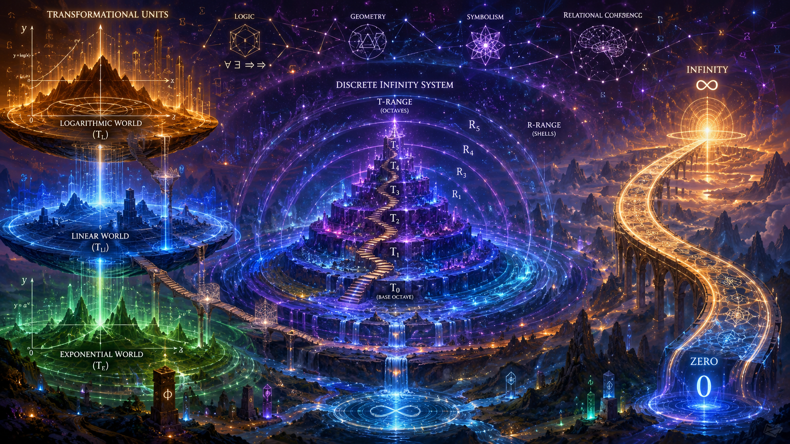
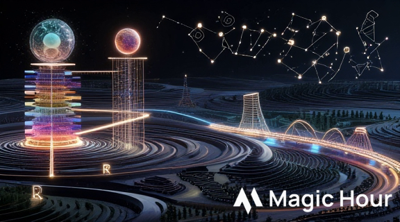
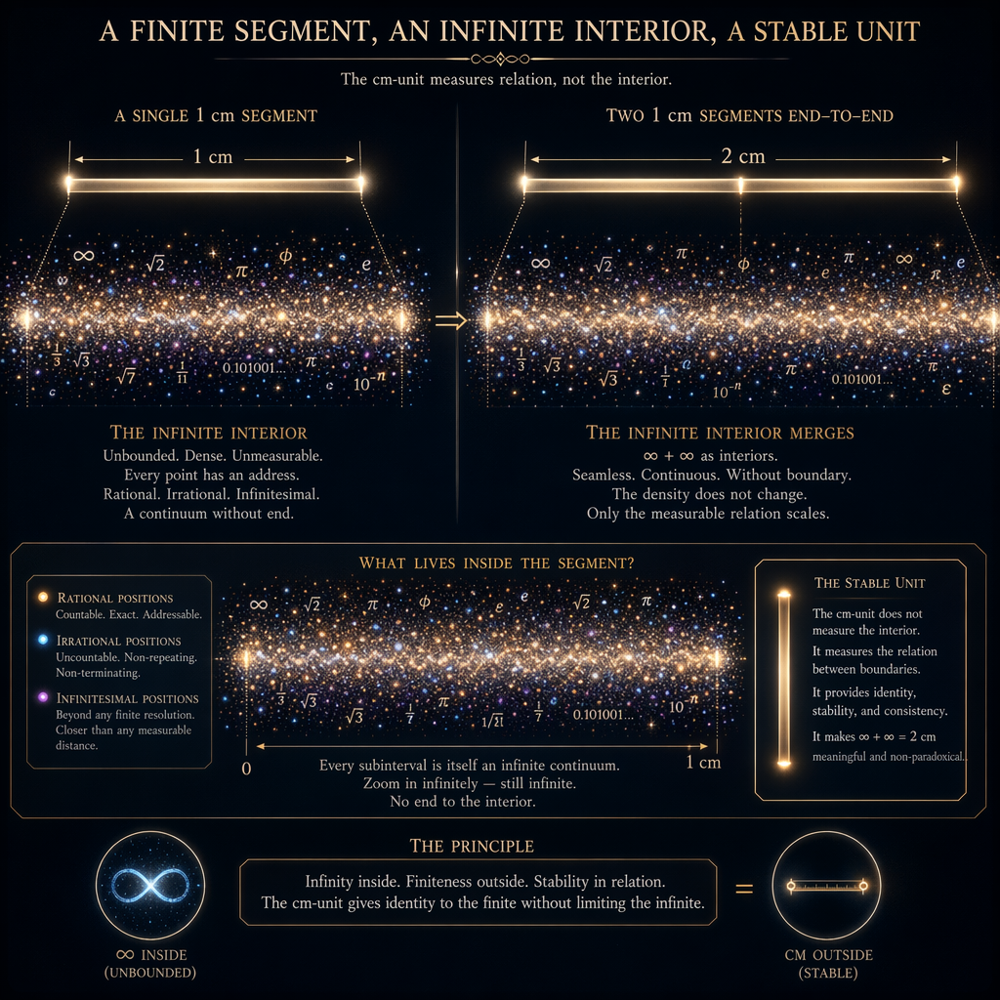
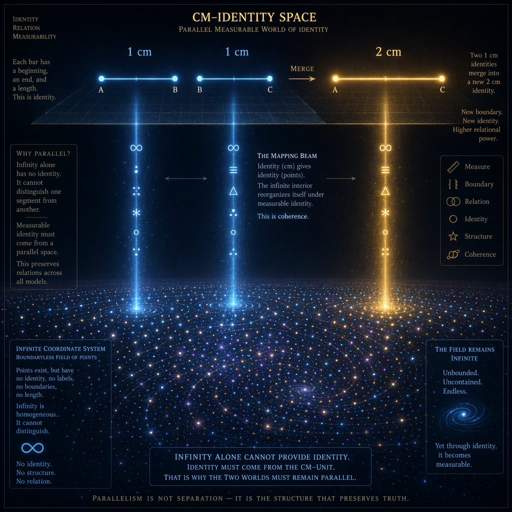

## Laegna Infinity Axiomatic System — Unit 1 (Transformational Units)



```

```

```
A grand, multi‑layered conceptual landscape illustrating the three
transformational units of Laegna infinity mathematics: logarithmic, linear,
and exponential. The scene is divided into three vast coordinate worlds,
stacked vertically like geological strata, each representing one of the
transformational units.

At the top, the logarithmic world appears as a compressed, dense terrain of
folded ridges and tightly packed valleys. The landscape bends inward, forming
curved structures that resemble logarithmic spirals. Numbers appear as glowing
glyphs embedded in the terrain, each glyph shrinking or expanding depending on
its log‑unit interpretation. The air is filled with drifting log‑symbols,
suggesting compression, density, and relational scaling.

In the middle, the linear world stretches outward as a calm, balanced plain.
Straight lines extend across the horizon, forming a grid that feels stable and
neutral. Numbers appear as evenly spaced markers along these lines, each
representing the linear interpretation of magnitude. The terrain is smooth,
with gentle slopes and clear pathways, symbolizing the simplicity and clarity
of linear behavior.

At the bottom, the exponential world rises dramatically, forming towering
structures that grow upward with explosive intensity. The terrain is filled
with exponential pillars, each representing rapid growth. Numbers appear as
bright, ascending glyphs, glowing more intensely as they rise. The air is
alive with flowing exponent‑symbols, suggesting acceleration, expansion, and
unbounded potential.

Between the three worlds, a vertical column of LaeLane projections shows how
(Z, X, Y) — the linear, logarithmic, and exponential dimensions — map into one
another. The column glows with soft light, forming a bridge between the units.
Arrows indicate the projection of Z into log‑X, and Y into exp‑X, showing how
numbers transform across coordinate worlds.

The overall mood is majestic and conceptual, conveying that the three
transformational units are not mere functions but living coordinate worlds
through which infinity expresses itself differently.
```


## Laegna Infinity Axiomatic System — Unit 2 (Discrete Infinities)





```

```

```
A structured, geometric landscape illustrating the discrete infinity system of
Laegna mathematics — the T‑range and R‑range octave system. The scene is
composed of nested geometric layers, each representing a compressed infinity
structure that expands into higher resolution when activated.

In the foreground, the T‑range appears as a base octave: a series of discrete
steps arranged like a staircase across the terrain. Each step is a glowing
platform, representing a discrete number. These platforms vary in size,
reflecting the density and relational behavior of discrete units. Small
symbols float above each platform, showing how discrete numbers behave when
interpreted through infinity.

Behind the T‑range, the R‑range rises as a series of exponential octaves. Each
octave is a large, curved structure that expands outward, forming a nested
shell around the T‑range. These shells glow with warm light, symbolizing
expansion, compression, and the dynamic behavior of infinity within discrete
systems. The shells pulse gently, indicating that each R‑value contains a
compressed T‑range within it.

To the left, a conceptual diagram shows how discrete numbers behave when
viewed through infinity. A small square with side length a=1 appears as a
simple geometric shape, while a=0.5 appears as a denser, more compact square,
suggesting that discrete units exist in different density worlds. The diagram
shows how discrete numbers map into geometric volumes, forming a bridge
between discrete and continuous infinity.

In the background, a vast geometric terrain stretches outward, composed of
nested octaves and discrete layers. The terrain shifts subtly, suggesting that
infinity arises naturally from finite structures. The sky is filled with
drifting octave symbols, forming constellations that represent the deeper
structure of discrete infinity.

The overall mood is structured, precise, and deeply mathematical, conveying
that infinite behavior can arise from finite, discrete systems through nested
octave relationships.
```


## Laegna Infinity Axiomatic System — Coherence Hint (Relational Infinity)


```

```

```
A conceptual, symbolic landscape illustrating the relational nature of
infinity — the coherence hint that binds the entire axiomatic system together.
The scene is composed of two vast conceptual entities: infinity and zero,
connected by a glowing relational bridge.

On the left, infinity appears as a towering, luminous structure rising into the
sky. Its surface is covered with flowing symbols, representing growth rates,
geometric densities, and octave cycles. The structure pulses with soft light,
suggesting unbounded magnitude.

On the right, zero appears as a deep, glowing well descending into the ground.
Its surface is smooth and reflective, symbolizing stillness, neutrality, and
the metaphysical property of equality. The well emits a faint glow, suggesting
that zero is not emptiness but a relational anchor.

Between the two, a glowing bridge connects infinity and zero. This bridge is
composed of drifting symbols that represent relational equality — the idea that
infinity is not a measurable magnitude but a relation preserved across units.
Symbols drift along the bridge, forming patterns that resemble SQL joins,
mapping values of zero to different scales while preserving relational
structure.

Above the bridge, conceptual diagrams show how relational equality works:
zero=zero across scales, infinity=infinity across units, and relational
structure preserved regardless of measurement. These diagrams float in the air,
forming a constellation of relational logic.

The overall mood is philosophical, symbolic, and deeply conceptual, conveying
that infinity is not a number but a relation — a coherence that binds the
transformational units and discrete infinities into a unified system.
```


## Laegna Infinity Axiomatic System — Conclusion (Unified Infinity Landscape)






```

```

```
A grand, unified landscape that combines all elements of the Laegna Infinity
Axiomatic System into a single conceptual world. The scene is composed of
three vast regions: the transformational units, the discrete infinities, and
the relational coherence layer, all merging seamlessly into one another.

On the left, the three transformational units rise as stacked coordinate
worlds — logarithmic, linear, and exponential — each glowing with its own
distinct color palette. These worlds connect through vertical bridges,
symbolizing projection and transformation.

In the center, the discrete infinity system forms a nested terrain of octaves
and layers. The T‑range appears as a staircase, while the R‑range forms
expanding shells around it. These structures pulse gently, indicating dynamic
infinity behavior.

On the right, the relational coherence layer appears as a glowing bridge
connecting infinity and zero. This bridge spans the entire landscape, forming a
conceptual backbone that unifies all other structures.

Above the entire scene, drifting symbols form constellations representing the
broader Laegna sciences — logic, geometry, symbolism, and conceptual reasoning.
These constellations shift slowly, suggesting that the axiomatic system is
alive, evolving, and deeply interconnected.

The overall mood is majestic, unified, and deeply conceptual, conveying that
the Laegna Infinity Axiomatic System is not a collection of separate ideas but
a single, coherent landscape where transformational units, discrete infinities,
and relational logic merge into a unified mathematical world.
```

## cm‑Math — Infinite Interior of a Finite Segment



```

```

```
A conceptual, high‑resolution illustration showing how a finite 1 cm segment
contains an infinite interior, yet behaves consistently because the cm‑unit
provides a stable identity. The scene is divided into two layers: the infinite
interior below, and the stable measurable unit above.

In the lower layer, the infinite interior is depicted as a dense, glowing
continuum of points. These points fill the entire segment, forming a luminous
band of unbounded density. The points vary subtly in brightness, representing
rational, irrational, and infinitesimal addresses. The density feels infinite,
alive, and unmeasurable. Symbols drift through the band, representing ∞,
irrational positions, and infinitesimal coordinates. The interior looks like a
living mathematical fabric, shimmering with infinite detail.

Above this dense interior, the cm‑unit appears as a clean, stable ruler. It is
a straight, minimal bar with two clear boundaries: a beginning and an end. The
ruler glows softly, symbolizing identity, stability, and measurement. The
boundaries are sharp and well‑defined, contrasting with the infinite interior
below. The ruler ignores the infinite density and measures only the external
relation: 1 cm.

To the right, two 1 cm segments are placed end‑to‑end. Their infinite interiors
merge seamlessly, forming a longer band of infinite density. But the ruler
above shows a clean, stable relation: 2 cm. The infinite interior expands, but
the measurable identity scales linearly. This contrast is highlighted by a
soft glow around the boundaries of the combined segment.

The overall mood is calm, conceptual, and precise. It conveys that infinity
inside a finite segment is unbounded, but the cm‑unit stabilizes the relation,
allowing ∞ + ∞ to behave as 2 cm without paradox.
```


## cm‑Math — Identity in Parallel Space



```

```

```
A symbolic, multi‑layered illustration showing why identity must be measured in
a parallel space for infinite sets to behave consistently. The scene is
composed of two parallel worlds: the infinite coordinate system below, and the
cm‑identity space above.

In the lower world, the infinite coordinate system is depicted as a vast,
boundaryless field of points. The field stretches infinitely in all
directions, filled with glowing dots representing coordinate positions. The
points have no labels, no boundaries, no identity. They drift in a soft,
ambient glow, symbolizing that infinity alone cannot distinguish one segment
from another. The field feels shapeless, homogeneous, and unanchored.

Above this infinite field floats the cm‑identity space. It is a parallel
measurable world composed of clean geometric bars, each representing a segment
with a beginning, an end, and a length. These bars glow with stable light,
symbolizing identity and relational structure. Each bar is clearly labeled:
1 cm, 1 cm, 2 cm. The bars exist independently of the infinite field below,
providing structure and meaning.

A glowing vertical beam connects the two worlds. This beam represents the
mapping from infinite interior to measurable identity. Symbols drift along the
beam, showing how the infinite interior reorganizes itself under the identity
of the segment. The beam pulses softly, symbolizing coherence: identity(cm)
gives identity(points).

To the right, two 1 cm bars merge into a 2 cm bar. The infinite field below
remains unbounded, but the identity space above shows a clean, stable relation.
The new 2 cm bar glows more brightly, symbolizing higher relational power: a
new boundary, a new identity, a new measurable space.

The overall mood is philosophical and structured. It conveys that infinity
cannot provide identity by itself, and that measurable identity must come from
a parallel space — the cm‑unit — which stabilizes infinite interiors and
preserves relations across all models.
```

## Simply About Infinities — Opening Image

```

```

```
A vast, luminous conceptual landscape that introduces the entire “Simply About
Infinities — Second Attempt” document. The scene is designed as a gateway into
the purified infinity framework: two essential units, one coherence principle,
and the relational geometry that binds them.

The foreground shows three parallel coordinate worlds rising from the ground:
logarithmic, linear, and exponential. They appear as three glowing terrains,
each with its own curvature and density. The logarithmic world is compressed
and folded, with tight ridges and inward‑pulling spirals. The linear world is a
calm, evenly spaced plain with straight horizon lines. The exponential world is
a dramatic upward surge of geometric towers, each representing explosive
growth.

These three terrains converge into a central “identity beam,” a vertical column
of soft light that symbolizes the purified core of the document: the
log‑lin‑exp triad. Symbols drift upward through the beam, representing the
transformational nature of number identity across scales.

Behind the triad, a second layer emerges: the discrete infinity system. The
T‑range appears as a staircase of glowing platforms, while the R‑range forms
expanding shells around it. These shells pulse gently, indicating nested
infinite structure encoded inside finite ranges. The discrete system blends
into the continuous terrains, showing how the two units coexist.

Above everything floats the coherence principle. It appears as a glowing
horizontal bridge connecting two conceptual entities: infinity and zero. The
bridge emits soft waves of relational symbols, showing that identity must be
measured in a parallel space for infinite sets to behave consistently. The
bridge spans the entire landscape, forming the conceptual backbone of the
document.

In the sky, drifting constellations represent the broader ecosystem:
Spireason, LaeArve, LaeLane, and the infinite landscapes. These constellations
form subtle patterns that hint at the manifold structure of infinity explored
throughout the document.

The overall mood is majestic, conceptual, and inviting. It conveys that the
reader is entering a purified world where infinity is not chaos but structure,
not magnitude but relation, not paradox but coherence.
```


## Simply About Infinities — Closing Image

```

```

```
A grand, unified conceptual image that concludes the “Simply About Infinities —
Second Attempt” document. The scene merges all conceptual components into a
single coherent world, symbolizing the closure of infinite branches and the
completion of the purified framework.

The foreground shows the three transformational units fully integrated. The
logarithmic terrain curves inward, the linear terrain stretches evenly, and the
exponential terrain rises outward. But unlike the opening image, these terrains
now blend seamlessly into one another, forming a single continuous surface. The
triad is no longer three worlds — it is one unified coordinate system where
identity shifts smoothly across scales.

In the mid‑ground, the discrete infinity system appears as a nested geometric
structure. The T‑range staircase and the R‑range shells are now intertwined,
forming a spiraling octave tower. The tower glows with warm light, symbolizing
the layered infinite structure encoded inside finite ranges. The tower rotates
slowly, showing dynamic coherence between discrete and continuous infinities.

To the right, the relational bridge between infinity and zero expands into a
full conceptual arch. Infinity rises as a luminous tower, zero descends as a
reflective well, and the arch between them forms a complete loop. Symbols drift
along the arch, forming patterns that represent relational equality across
parallel measurable spaces. The arch pulses gently, symbolizing the coherence
principle that binds the entire system.

Above the unified landscape, drifting constellations form a final pattern: the
Laegna glyphs I, O, A, E arranged in a harmonious configuration. These glyphs
glow softly, representing the deeper truth‑value structure underlying all
infinity relations. The constellations slowly rotate, suggesting that the
system is alive, evolving, and conceptually complete.

In the background, faint silhouettes of earlier landscapes — infinite circles,
exterior spaces, octave fields — appear as echoes. They are not active worlds
anymore; they are resolved branches, absorbed into the purified core. Their
presence symbolizes closure: the infinite explorations have found their
foundation.

The overall mood is serene, complete, and deeply coherent. It conveys that the
reader has reached the end of the purified infinity journey: a unified world
where all branches converge, all relations stabilize, and infinity becomes a
navigable, structured, relational landscape.
```
